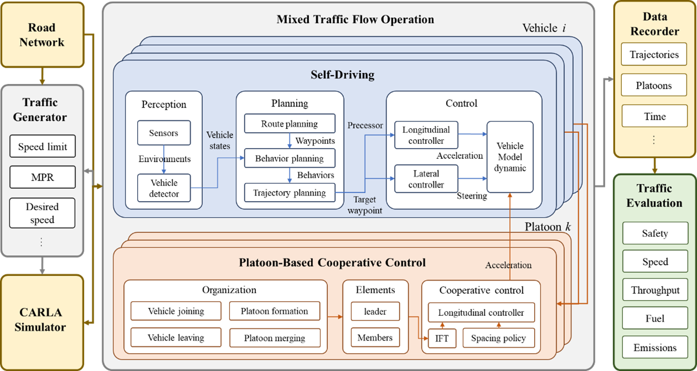
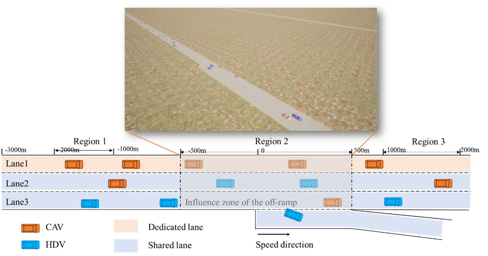

# Mixed traffic flow simulation with CARLA simulator
## Overview
&emsp;&emsp;With the development of Connected Automated Vehicle (CAV) technology, mixed traffic consisting of Human-Driven Vehicles (HDVs) and CAVs will exist for a long time. Therefore, mixed traffic simulation is important in autonomous driving testing, microscopic traffic charateristics analysis, traffic management strategy evaluation, etc. However, current simulation platforms fail to satisfy the requirements of complex environment and realistic traffic simulation. This program develops a mixed traffic simulation platform driven by microscopic traffic flow models and coupled with the platoon-based cooperative control strategy based on CARLA simulator. In this platform, traffic flow are modeled from car-following and lane-change behaviors. The IDM car-following model and MOBIL lane-change model are introduced for HDVs. The ACC and CACC car-following models are introduced for CAVs following different types of vehicles. A discretionary lane-change model that considers differences of desired time gaps following different types of vehicles is proposed for CAVs. Besides, a mandatory lane-change model that integrates safety and timeliness is also designed. On this basis, we design modules like traffic generation with customized parameters, traffic operation driven by microscopic models, and multidimensional evaluation of traffic conditions based on CARLA simulator. Besides, a longitudinal platoon control strategy using linear feedback control is established for CAVs on the dedicated lanes and a platoon-based cooperative control module is added to the platform.  
## Simulation structure of the platform

## Simulation scenario: a case study

